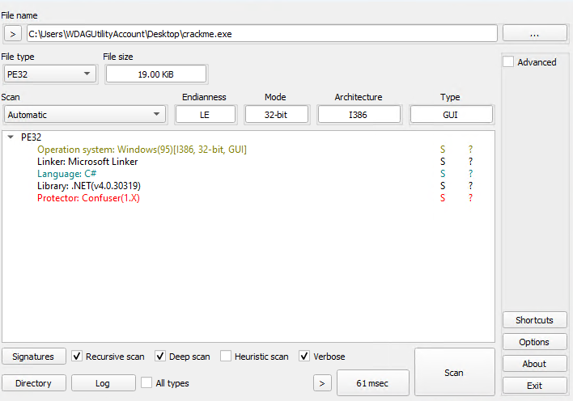
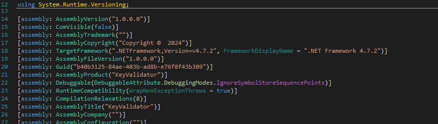
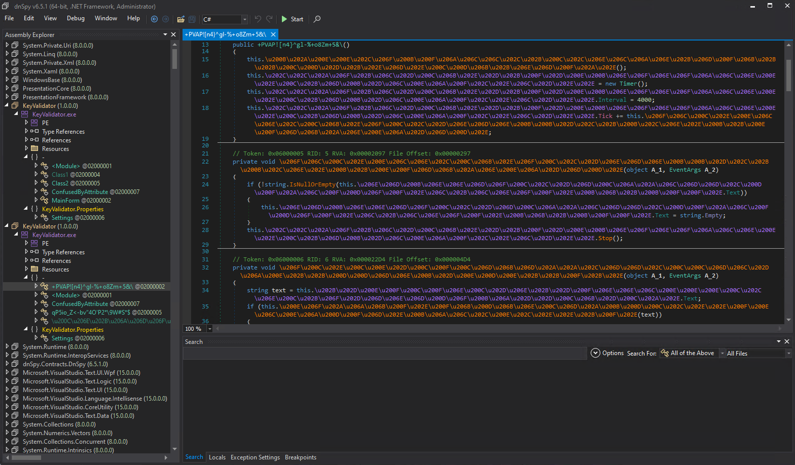
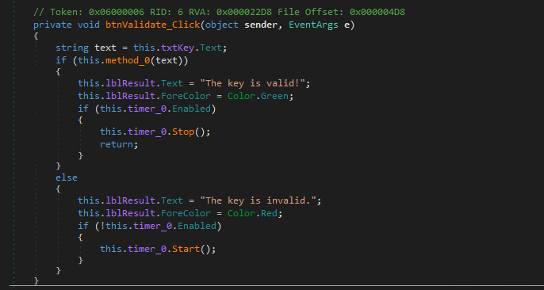
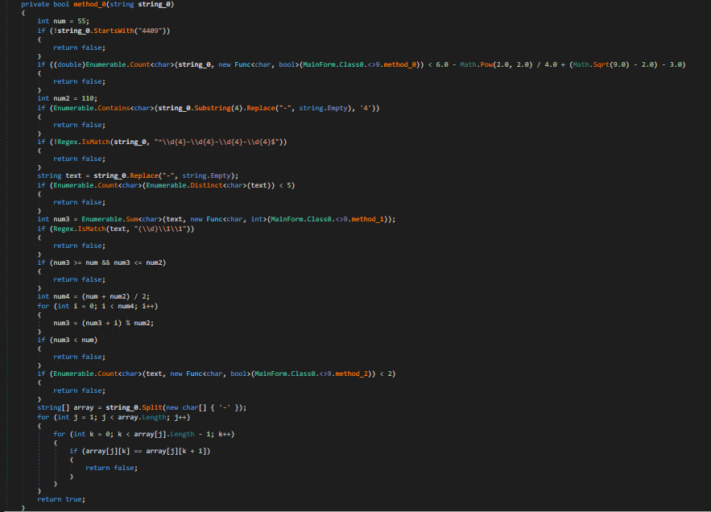
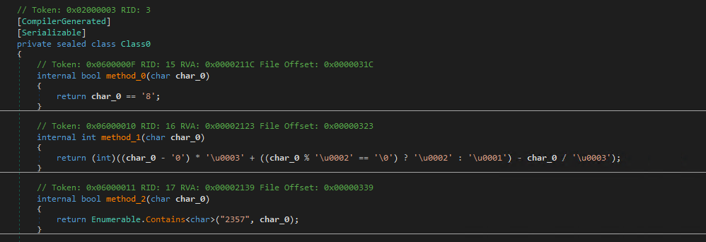
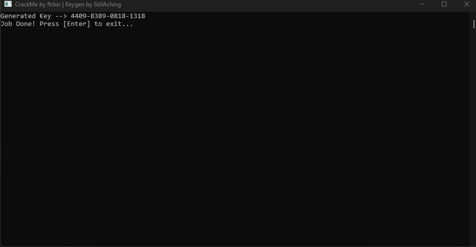
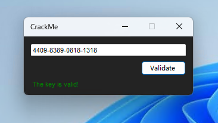

# flcksr's .NET CrackMe

Today we have this CrackMe from the user ``flcksr`` from CrackMes.one

https://crackmes.one/user/flcksr

And here is the link to the CrackMe

https://crackmes.one/crackme/6675db88e7b35c09bb26703c

the objective of this crackme is for the user to figure out the correct algorithm and generate a valid license key to "activate" the license and create an application that replicates the process of that.

First thing I did was use ``DIE`` to view information about the assembly

Then I find out that assembly is written in .NET and not only that but it is also obfuscated with an obfuscator known as ConfuserEX.
Now I went ahead and viewed the assembly's properties in dnSpy to see that it was a .NET Framework 4.7.2 assembly.

I opened the first class and confirm that the assembly is indeed obfuscated.

Now after I deobfuscate the assembly I go on ahead and take a look at the methods and the first thing I noticed was the key validation logic process:

1) Retrieves the entered key from ``txtKey``.
2) Calls ``method_0 to`` validate the key.
3) Updates ``lblResult`` with the validation outcome.
Manages the timer based on the validation result.

Now the second thing is we go on ahead and take a look at ``method_0``, and this method contains the core validation logic with several checks

Here is a break down of the checks:

1) The key must begin with the digits "4409".
2) Counts the number of '8's in the key, there must be at least 1 '8' in the key.
3) No '4's after the first four characters so after removing hyphens and the first four characters the remaining key must not contain the digit '4'.
4) The key format's is that the key must match this pattern like "xxx-xxxx-xxxx-xxxx" (where each ``x`` is a digit).
5) At least 5 distinct digits so the key must contain at least five unique digits.
6) sum of digits with custom calculation: each digit is transformed using ``method_1`` before summing, this transformation is non-trivial and affects the validation logic.
7) No three consecutive identical digits that means the key must not contain any sequence of three identical digits (example: "111").
8) The sum (num3) must not be between 55 and 110 inclusive. 

Further manipulation of the sum:
(55 + 110) / 2 = 82

The sum is updated in a loop: num3 = (num3 + i) % 110 for i from 0 to 81.

If the final num3 is less than 55 then the key is invalid.

9) At least two Digits in "2, 3, 5, 7" so the key must contain at least two digits that are either 2, 3, 5, or 7.
10) No two identical consecutive digits in subsequent groups so after the first group each subsequent group must not have two identical consecutive digits.

Then after I scroll down a bit, I see the helper Class ``Class0``, this is a nested class likely generated by the compiler for lambda expressions used in LINQ queries

``method_0`` Checks if a character is '8'.
``method_1`` Transforms a digit character into an integer based on a custom formula.
``method_2`` Checks if a character is one of '2', '3', '5', or '7'.

Ok, now that I figured out how the application generates a key based on using a predefined algorithm. Its time to create an app that replicates the process, I will choose to write in C#, You can view the source code in here:

https://github.com/StillAching/CrackMes-Depot/tree/main/CrackMes.one/CrackMe-by-flcksr/flcksr-crackme-keygen

Alright, now that I've ran my application, it gave me the license key for the CrackMe so let's go ahead and test it

And here are the results:

That's all folk!
