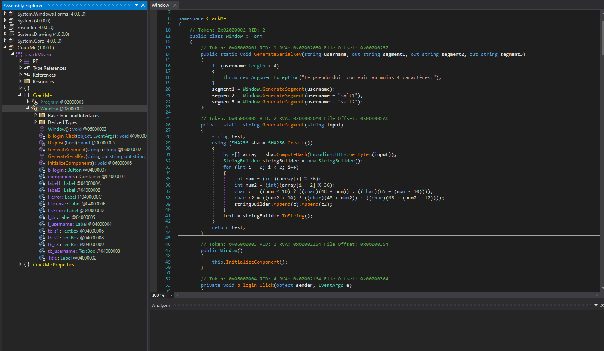
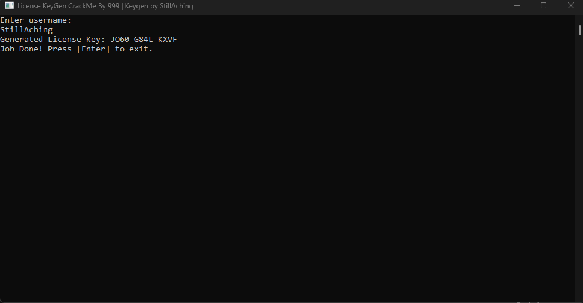
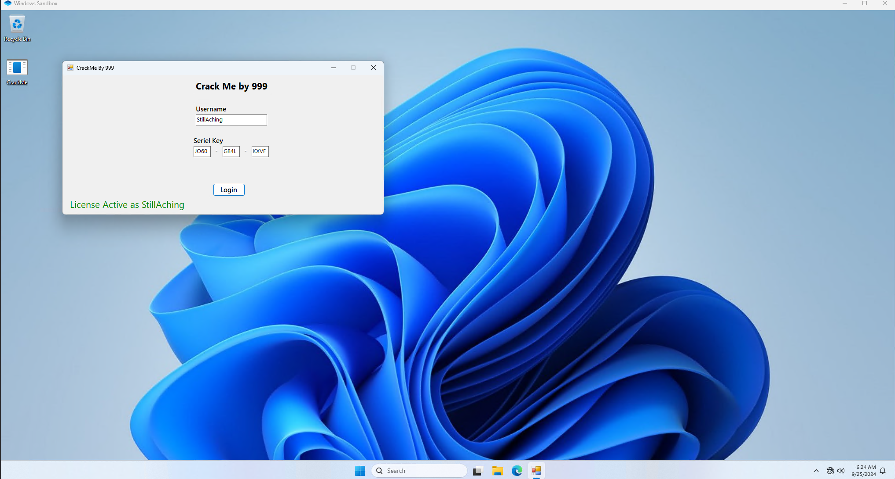

# License KeyGen By 999

We have this CrackMe from the user ``999`` from CrackMes.one

https://crackmes.one/user/999

And here is the link to the CrackMe

https://crackmes.one/crackme/66b8ae6e90c4c2830c821e98

the objective of this crackme is for the user to r figure out the correct algorithm and generate a valid license key to "activate" the license and create an application that replicates the process of that.

First I decompile the CrackMe



Then I find out that The key generation logic is encapsulated in the GenerateSerialKey and the GenerateSegment methods.

1) GenerateSerialKey Method:
Takes the username as input and generates three segments of the key.
Uses the base username and the username concatenated with "salt1" and "salt2" to generate the three segments:
```csharp
segment1 = Window.GenerateSegment(username);
segment2 = Window.GenerateSegment(username + "salt1");
segment3 = Window.GenerateSegment(username + "salt2");
```
Calls the GenerateSegment method three times to produce three 4-character segments.

2) GenerateSegment Method: Hashes the input string using the SHA256 hashing algorithm
```csharp
byte[] array = sha.ComputeHash(Encoding.UTF8.GetBytes(input));
```
Converts specific bytes of the hash into two pairs of characters. Each character is generated based on the hash value and converting it to a numeric or alphabetic character:
```csharp
int num = (int)(array[i] % 36);
int num2 = (int)(array[i + 2] % 36);
char c = ((num < 10) ? ((char)(48 + num)) : ((char)(65 + (num - 10))));
char c2 = ((num2 < 10) ? ((char)(48 + num2)) : ((char)(65 + (num2 - 10))));
stringBuilder.Append(c).Append(c2);
```
This method generates a 4-character segment for the license key.

----

Now that I figured out how the application generates a key based on the username using a predefined algorithm (with GenerateSerialKey and GenerateSegment). Its time to create an app that replicates the process, I will choose to write in C#, You can view the source code in here:


Alright, now that I've ran my application, it gave me the license key for the CrackMe



The only thing left, is to test if wether my key will work or not




That's all folk!