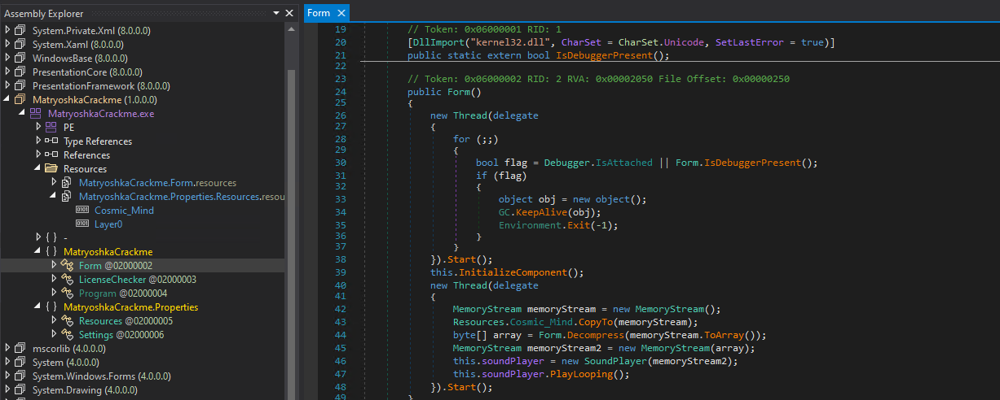
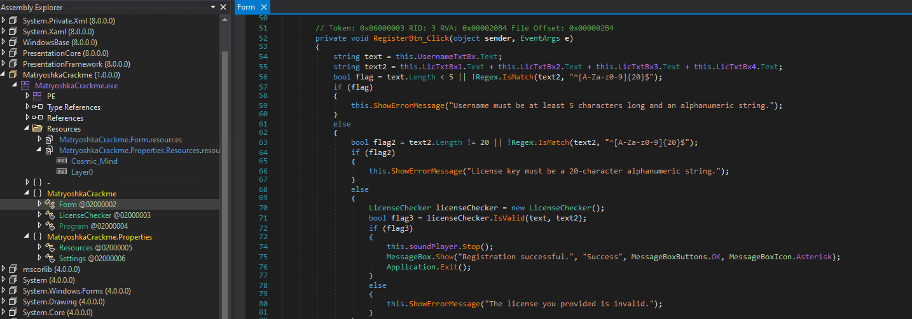
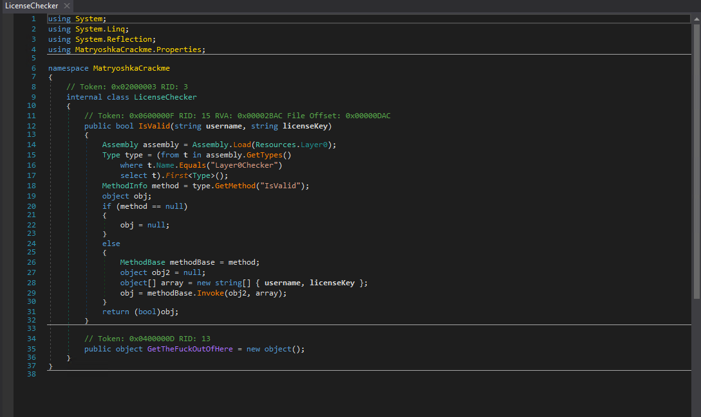
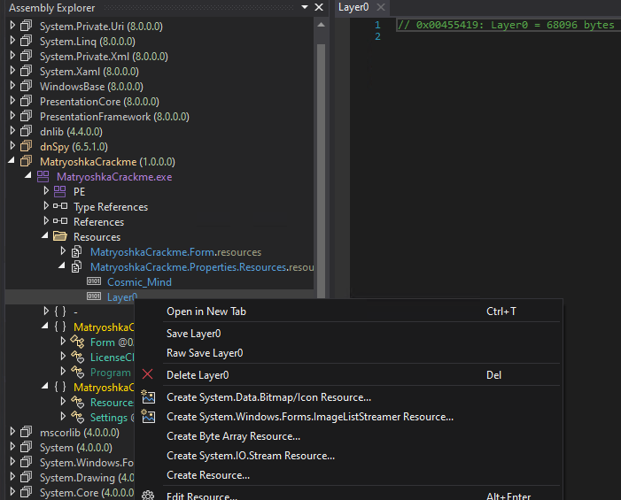
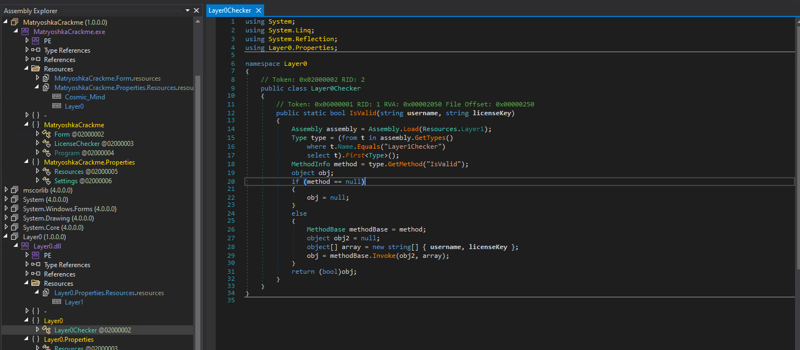
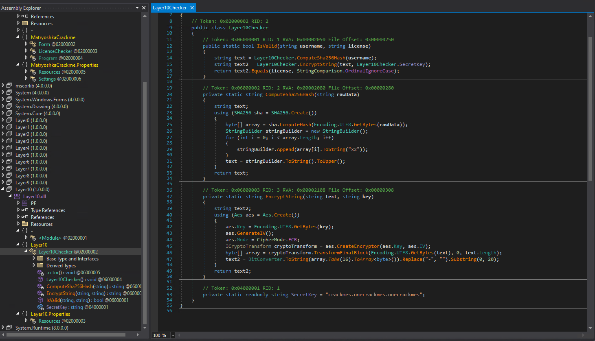
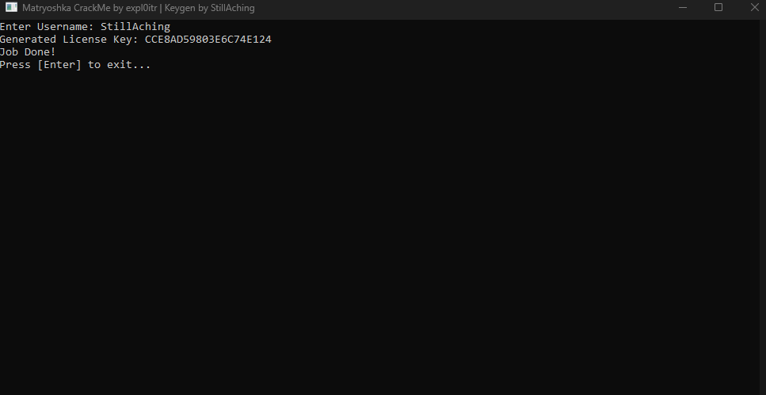
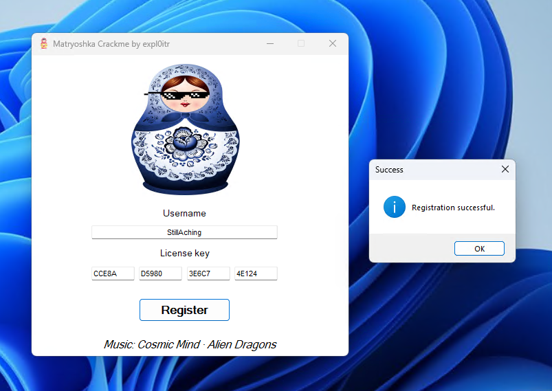

# Matryoshka By expl0itr

We have this CrackMe from the user ``expl0itr`` from CrackMes.one

https://crackmes.one/user/expl0itr

And here is the link to the CrackMe

https://crackmes.one/crackme/66cb0b51b899a3b9dd02af96

The author of this CrackMe didn't exactly specify what the objective was but I'm going to assume that the objective of this crackme is to figure out the correct algorithm and generate a valid license key to "activate" the license and create an application that replicates the process of that.

First I decompile the CrackMe

And the first thing I noticed was the implementation of Anti-Debugging Mechanism
The constructor of the form (Form()) creates a new thread that continuously checks if a debugger is attached to the process using two methods:

``Debugger.IsAttached``: Checks if a managed debugger is attached to the process.

``Form.IsDebuggerPresent()``: Calls the Windows API IsDebuggerPresent function to check if a native debugger is present.
If either method returns true (A.K.A a debugger is detected) then the application would immediately exit with ``Environment.Exit(-1)``.

This anti-debugging thread ensures that the program terminates if someone tries to attach a debugger which is a common practice in reverse engineering and cracking.

Ok, so after scrolling down a a bit I noticed a function that has the "license" registration logic.

When the user clicks the Register button the ``RegisterBtn_Click`` event handler is triggered:

Input Validation: The application first checks if the username is at least 5 characters long.
It also checks that the combined license key from all four textboxes is a 20-character alphanumeric string.

Now let's go and check out the class ``LicenseChecker``

If the input is valid the ``LicenseChecker`` class is used to validate the license.
The ``IsValid`` method of ``LicenseChecker`` uses reflection to load an embedded assembly (the Layer0 resource) then finds a class named ``Layer0Checker``, and calls its ``IsValid`` method.
The ``IsValid`` method of ``Layer0Checker`` checks if the given username and license key match the expected values based on an encryption scheme.

Now I'll go to see what ``Layer0Checker`` is, I save the resource

And now after I decompiled it:

Its pretty much the same function from ``LicenseChecker`` except that the resource also has its own resource embedded and this will continue again & again again & again again & again again & again again & again again & again again & again again & again again & again again & again again & again again & again again & again again & again again & again again & again again & again again & again again & again again & again again & again again & again again & again again & again 

So I will just skip to the part of me repeating the same process untill Layer10

So now after finally reaching Layer10 I can finally see that the license key is generated by encrypting the SHA-256 hash of the username using a specific secret key which is ``crackmes.onecrackmes.onecrackmes`` 

Here’s a breakdown of the process:

1) Compute the SHA-256 Hash of the Username: The ``ComputeSha256Hash`` method converts the username into its SHA-256 hash representation.

2) Encrypt the SHA-256 Hash: The ``EncryptString`` method then encrypts this hash using AES encryption with a specific key, in ECB mode but only the first 16 bytes of the encryption result are used and formatted as a 20-character hexadecimal string (by removing hyphens).

Now to create a key generator that produces valid license keys I will need to replicate this process exactly. Below is the src code of a CLI app that I've written in C# that implements the key generation logic:

https://github.com/StillAching/CrackMes-Depot/blob/main/CrackMes.one/Matryoshka-By-expl0itr/Matryoshka-Solution/Matryoshka-Keygen/Program.cs

Now that I've built my app its time to run it and see the key that it generated for me

Alright now that my application have generated a key for me the only thing thats left is to go and test it on the CrackMe and see if I have replicated the KeyGen process correctly

And here are the results!

That's all folk!
