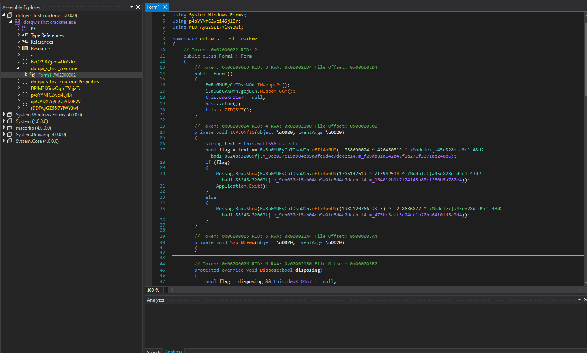
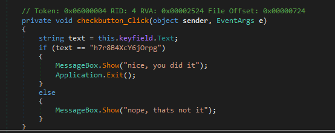
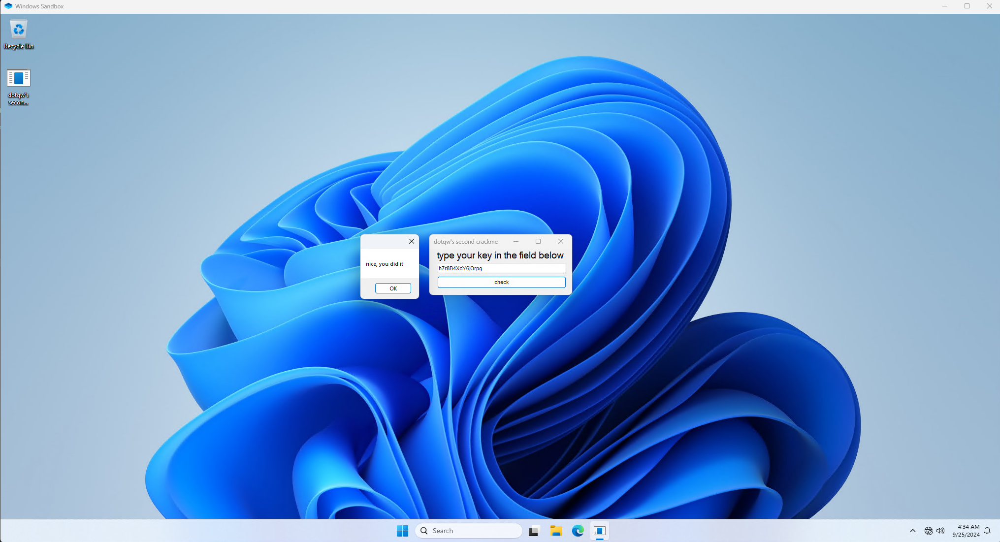

# dotqw's-second-crackme

We have this CrackMe from the user ``0ya3um1`` from CrackMes.one

https://crackmes.one/user/0ya3um1

And here is the link to the CrackMe

https://crackmes.one/crackme/66d21d3c10703232965546b4

the objective of this crackme is to find the correct "password"

First I tried to decompile the CrackMe but only to find out that it was obfuscated

After the deobfuscation I looked around to find the method that contained the password

we can see in the method that the password of this crackme is ``h7r8B4XcY6jOrpg``

So I proceeded to put in the password to check if it was indeed correct and heres the result

That's all folks!